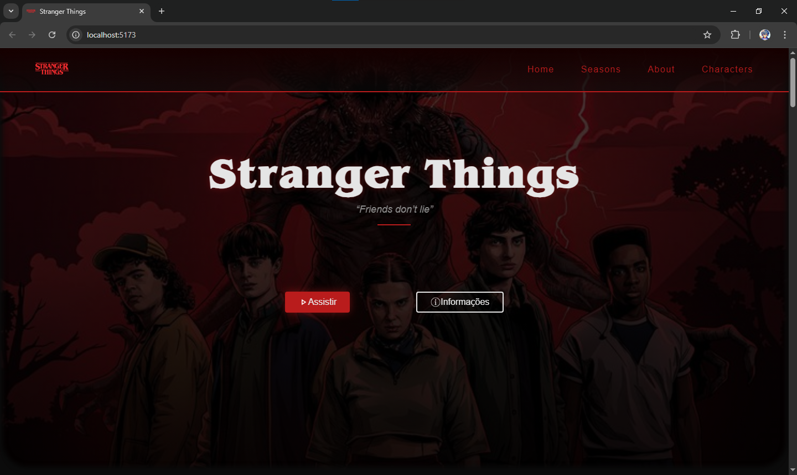

# 🎬 Stranger Things – Website Responsivo

Projeto front-end desenvolvido com foco em **design moderno**, **responsividade** e **boas práticas de layout**, inspirado na série *Stranger Things*.

O objetivo foi criar uma interface visualmente imersiva, organizada em seções bem definidas, com grid responsivo e atenção à tipografia e espaçamentos.

---

## 🚀 Tecnologias utilizadas

- ⚛️ React
- 🎨 CSS Modules
- 📐 CSS Grid & Flexbox
- 📱 Design Responsivo
- ✨ Animações com CSS

---

## 📱 Responsividade

O layout se adapta automaticamente para diferentes tamanhos de tela:

- 🖥️ Desktop: até **3 colunas**
- 💻 Tablets: **2 colunas**
- 📱 Mobile: **1 coluna**

Utilizando **CSS Grid** com media queries bem definidas para evitar quebras de layout.

---

## 🎨 Destaques de UI

- Grid limitado a no máximo 3 colunas
- Tipografia escalável com `clamp()`
- Imagens com efeito glow e hover
- Seções com overlay e gradientes sutis
- Layout limpo e centralizado em mobile

---

## 🧠 Aprendizados

- Organização de componentes em React
- Controle de layout com Grid responsivo
- Planejamento de breakpoints
- Separação de responsabilidade entre estrutura e estilo

---

## 📸 Preview

> Adicione uma imagem chamada **preview.png** na raiz do repositório  
> (print da tela inicial do site)

---

## 📌 Status do projeto

✅ Em desenvolvimento / Portfólio

---

## 👨‍💻 Autor

**Mizum.dev**  
Front-end Developer em formação

🔗 GitHub: https://github.com/seu-usuario
