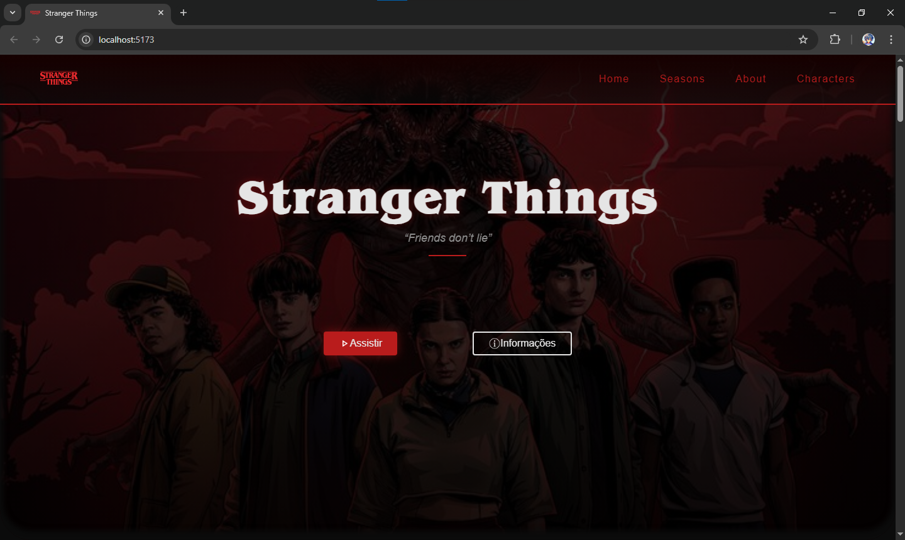

# 🎬 Stranger Things – Website Responsivo

> Interface digital visualmente imersiva e responsiva, inspirada na estética e na atmosfera da série Stranger Things.

---

## 🌓 Visualização



---

## 🚀 Objetivo
O objetivo principal deste projeto foi consolidar conhecimentos avançados de layout e estilização no ecossistema do React. O foco foi criar uma interface moderna com forte apelo visual, garantindo que a tipografia e o grid se adaptem perfeitamente a qualquer tamanho de tela sem perder a identidade estética da série.

---

## 🛠️ Tecnologias e Conceitos
O projeto foi construído utilizando as melhores práticas de arquitetura CSS e componentização:

* **React**: Biblioteca utilizada para modularizar as seções da página em componentes limpos e reutilizáveis.
* **CSS Modules**: Abordagem de estilização escopada por componente, garantindo que as classes não sofram interferências globais.
* **CSS Grid & Flexbox**: Utilizados de forma combinada para estruturar o posicionamento dos elementos e gerenciar o alinhamento do conteúdo.
* **Responsividade Avançada**: Uso de funções modernas do CSS, como `clamp()`, para criar uma tipografia perfeitamente escalável entre diferentes dispositivos.

---

## 🏗️ Funcionalidades e Destaques de UI
* 📱 **Grid Adaptativo**: Organização inteligente do layout que se reconfigura automaticamente em até 3 colunas no Desktop, 2 colunas em Tablets e 1 coluna em dispositivos Mobile.
* ✨ **Efeitos Atmosféricos**: Imagens com efeitos de *glow* (brilho) e animações suaves de *hover*, simulando a identidade visual misteriosa da série.
* 🎨 **Design Imersivo**: Uso de overlays escuros e gradientes sutis sobre as seções para garantir o contraste e a leitura da tipografia temática.

---

## 🔄 Como Rodar o Projeto

Para executar este projeto localmente, siga os passos abaixo:

1. **Clone o repositório:**
   ```bash
   git clone https://github.com/Herdes-s/Stranger-Things-Site
   ```
   
2. **Acesse a pasta do projeto:**
    ```bash
    cd Stranger-Things-Site
    ```

3. **Instale as dependências:**
    ```bash
    npm install
    ```

4. **Inicie o servidor de desenvolvimento:**
    ```bash
    npm start
    ```

---

## 🧠 Desafios e Aprendizados
* **Desafio:** O maior desafio foi garantir que as imagens com efeito glow mantivessem o alinhamento correto e a proporção visual ao mudar o número de colunas no grid.
* **Solução:** Resolvi isso aplicando propriedades de object-fit combinadas com media queries estratégicas baseadas em CSS Grid, mantendo a proporção travada em 16:9.

---

## 🔗 Link de Acesso
Confira o projeto online: [**Visualizar Stranger Things Web**]("https://stranger-things-site-taupe.vercel.app/")

---

## 👤 Autor
Desenvolvido por **Ernand Soares**.